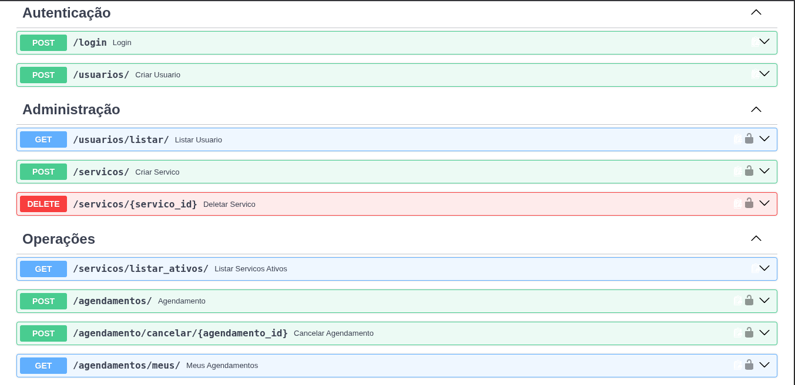

<div align="center">

# Barbearia API

### Sistema de agendamentos de barbearia feito com FastAPI, SQLAlchemy e Docker

[](https://www.python.org/)
[](https://fastapi.tiangolo.com/)
[](https://www.docker.com/)
[](https://www.postgresql.org/)

</div>

---

## Sobre o projeto

API REST para gerenciar agendamentos de barbearia. Permite cadastro de usuários, autenticação via JWT, catálogo de serviços com CRUD e agendamentos com validações de horário, conflitos e permissões.

### API Online

🔗 **https://projetoapi-sziu.onrender.com/docs**



---

## Funcionalidades

- **Autenticação JWT** — Login com tokens de expiração configurável
- **Controle de acesso** — Dois níveis: usuários comuns e administradores
- **CRUD de serviços** — Administradores criam e desativam serviços (soft-delete)
- **Agendamento inteligente** — Valida horário comercial (08h-20h), impede passado e detecta conflitos
- **Cancelamento seguro** — Somente o dono ou um admin pode cancelar
- **Preço congelado** — Valor registrado no momento do agendamento

---

## Stack utilizada

| Camada | Tecnologia |
|--------|-----------|
| Linguagem | Python 3.11 |
| Framework | FastAPI |
| ORM | SQLAlchemy 2.0 |
| Banco de dados | PostgreSQL 15 (Docker) / SQLite (local) |
| Senhas | Argon2id |
| Autenticação | JWT via python-jose |
| Validação | Pydantic v2 |
| Migrations | Alembic |
| Containerização | Docker + Docker Compose |
| Testes | pytest + pytest-cov |

---

## Estrutura do projeto

```
projetoapi/
├── app/
│   ├── __init__.py          # Pacote da aplicação
│   ├── main.py              # Rotas, dependências e instância do FastAPI
│   ├── database.py          # Engine SQLAlchemy e sessão do banco
│   ├── models.py            # Modelos ORM (User, Servico, Agendamento)
│   ├── schemas.py           # Schemas Pydantic para request/response
│   └── utils.py             # Hash de senhas (Argon2id) e JWT
├── tests/
│   ├── __init__.py          # Pacote de testes
│   ├── conftest.py          # Fixtures (banco em memória, clientes HTTP, auth)
│   ├── test_rotas.py        # Testes de criação de usuário
│   ├── test_login.py        # Testes de autenticação
│   ├── test_servicos.py     # Testes de serviços e permissões
│   ├── test_agendamentos.py # Testes de agendamento e validações
│   └── test_utils.py        # Testes de hash de senhas e JWT
├── alembic/
│   ├── env.py               # Configuração do Alembic
│   ├── script.py.mako       # Template para novas migrations
│   └── versions/            # Scripts de migração
│       └── 3fe0c0ec72a4_criar_tabelas_iniciais.py
├── alembic.ini              # Configuração do Alembic
├── dockerfile               # Build da imagem Python
├── docker-compose.yml       # Orchestration: PostgreSQL + API
├── requirements.txt         # Dependências Python
├── docs/
│   └── screenshot.png       # Screenshot da API no Swagger
├── .env.example             # Template de variáveis de ambiente
└── .gitignore
```

---

## Como rodar

### Pré-requisitos

- [Docker](https://docs.docker.com/get-docker/) e [Docker Compose](https://docs.docker.com/compose/install/)

### 1. Clone o repositório

```bash
git clone https://github.com/H1lbert-kt/projetoapi.git
cd projetoapi
```

### 2. Configure as variáveis de ambiente

```bash
cp .env.example .env
```

Edite o `.env` com seus valores:

```env
SECRET_KEY=sua_chave_secreta_aqui
ALGORITHM=HS256
ACCESS_TOKEN_EXPIRE_MINUTES=30
POSTGRES_PASSWORD=sua_senha_segura
DATABASE_URL=postgresql://admin:sua_senha_segura@db:5432/barbearia
```

### 3. Suba os containers

```bash
docker-compose up --build
```

A API estará disponível em: **http://localhost:8001/docs**

### 4. Execute as migrações do banco

```bash
alembic upgrade head
```

Isso cria todas as tabelas definidas nos models.

---

## Migrations

O projeto utiliza Alembic para gerenciar migrações do banco de dados.

### Comandos úteis

```bash
# Aplicar todas as migrations pendentes
alembic upgrade head

# Voltar uma migration
alembic downgrade -1

# Criar uma nova migration após alterar os models
alembic revision --autogenerate -m "descrição_da_mudança"

# Verificar a migration atual
alembic current

# Ver histórico de migrations
alembic history
```

---

## Variáveis de ambiente

| Variável | Descrição | Default |
|----------|-----------|---------|
| `SECRET_KEY` | Chave secreta para assinar tokens JWT | — |
| `ALGORITHM` | Algoritmo de assinatura JWT | `HS256` |
| `ACCESS_TOKEN_EXPIRE_MINUTES` | Tempo de expiração do token (minutos) | `30` |
| `DATABASE_URL` | URL de conexão com o banco | `sqlite:///./banco.db` |
| `POSTGRES_PASSWORD` | Senha do PostgreSQL (usado no Docker) | — |

---

## Endpoints

### Autenticação

| Método | Rota | Autenticação | Descrição |
|--------|------|:------------:|-----------|
| `POST` | `/usuarios/` | Não | Criar novo usuário |
| `POST` | `/login` | Não | Login e retorno do token JWT |

### Administração

| Método | Rota | Autenticação | Descrição |
|--------|------|:------------:|-----------|
| `GET` | `/usuarios/listar/` | Admin | Listar todos os usuários |
| `POST` | `/servicos/` | Admin | Criar novo serviço |
| `DELETE` | `/servicos/{id}` | Admin | Desativar serviço |

### Operações

| Método | Rota | Autenticação | Descrição |
|--------|------|:------------:|-----------|
| `GET` | `/servicos/listar_ativos/` | Não | Listar serviços ativos |
| `POST` | `/agendamentos/` | Usuário | Criar agendamento |
| `POST` | `/agendamentos/cancelar/{id}` | Usuário | Cancelar agendamento |
| `GET` | `/agendamentos/meus/` | Usuário | Listar meus agendamentos |

---

## Modelos de dados

### User

| Campo | Tipo | Descrição |
|-------|------|-----------|
| `id` | Integer | Identificador único (autoincremento) |
| `nome` | String | Nome do usuário |
| `email` | String | Email (único, indexado) |
| `is_admin` | Boolean | Perfil administrador (default: `false`) |

### Servico

| Campo | Tipo | Descrição |
|-------|------|-----------|
| `id` | Integer | Identificador único (autoincremento) |
| `nome` | String | Nome do serviço |
| `preco` | Float | Preço do serviço |
| `ativo` | Boolean | Status ativo (default: `true`) |

### Agendamento

| Campo | Tipo | Descrição |
|-------|------|-----------|
| `id` | Integer | Identificador único (autoincremento) |
| `data` | DateTime | Data e hora do agendamento (UTC) |
| `usuario_id` | Integer | FK → User |
| `servico_id` | Integer | FK → Servico |
| `preco_pago` | Float | Preço congelado no momento do agendamento |
| `status` | String | `confirmado` ou `cancelado` |

---

## Regras de negócio

- **Horário comercial:** Agendamentos somente entre 08h e 20h (UTC)
- **Sem agendamento no passado:** Data e hora devem ser futuras
- **Serviço ativo obrigatório:** Serviços desativados não podem ser agendados
- **Sem conflitos de serviço:** Dois agendamentos no mesmo horário para o mesmo serviço são bloqueados
- **Sem dupla reserva:** Um usuário não pode ter dois agendamentos no mesmo horário
- **Preço congelado:** O valor registrado é o preço do serviço no momento do agendamento
- **Cancelamento restrito:** Somente o dono do agendamento ou um administrador pode cancelar

---

## Segurança

- **Senhas:** Argon2id (recomendado pelo OWASP)
- **Tokens JWT:** Assinatura HS256 com expiração configurável
- **Validação de email:** Formato validado via Pydantic (`EmailStr`)
- **Controle de acesso:** Rotas administrativas protegidas por middleware de role
- **Soft-delete:** Serviços são desativados, não removidos do banco

---

## Testes

### Rodar localmente (sem Docker)

```bash
python -m venv venv
source venv/bin/activate
pip install -r requirements.txt
alembic upgrade head
pytest --cov=app tests/
```

### Estrutura dos testes

| Arquivo | Cobertura |
|---------|-----------|
| `test_rotas.py` | Criação de usuário, email duplicado |
| `test_login.py` | Login com sucesso, senha errada, usuário inexistente |
| `test_servicos.py` | Listar serviços, criar serviço (admin), permissão negada (user) |
| `test_agendamentos.py` | Agendamento válido, data passada, horário comercial, conflito, cancelamento |
| `test_utils.py` | Hash/verificação de senha, criação/verificação de JWT, token expirado |

---

## Como contribuir

1. Fork o repositório
2. Crie uma branch (`git checkout -b feature/nova-feature`)
3. Faça commit (`git commit -m 'Adiciona nova feature'`)
4. Push para a branch (`git push origin feature/nova-feature`)
5. Abra um Pull Request

---

<div align="center">

Feito com dedicação por [H1lbert-kt](https://github.com/H1lbert-kt)

</div>
